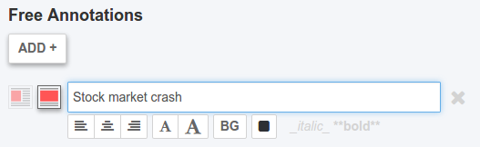

# chartwerk.text.annotations



Free text annotations are represented as an array of objects. They are rendered as absolutely positioned HTML elements.

```js
[
  {
    size: 's',
    w: 100,
    x: 10,
    y: 15,
    align: 'l',
    fontSize: 'm',
    background: false,
    text: 'This is a **text** note.',
    color: '#2d3035'
  }
]
```

- `size` -- Chart size to render annotation on. One of `s` for single or `d` for double.
- `w` -- Width of annotation container in pixels.
- `x` -- Absolute X position of annotation container in pixels.
- `y` -- Absolute Y position of annotation container in pixels.
- `align` -- Alignment of text within chart container. One of `l` for left, `c` for center or `r` for right.
- `fontSize` -- Font size. One of `s` for small or `m` for medium/regular.
- `background` -- Boolean, whether to render an opaque background behind the annotation.
- `text` -- Text of the annotation, formatted in markdown.
- `color` -- Color of annotation text.
