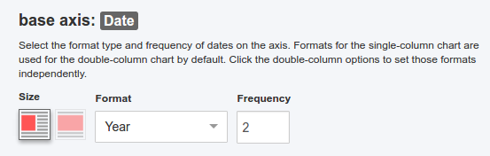
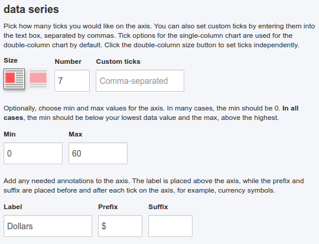

# chartwerk.axes

##### Base axis
- [axes.base](#base)
- [axes.base.type](#base-type)
- [axes.base.dateFormat](#base-dateFormat)
- [axes.base.max](#base-max)
- [axes.base.min](#base-min)
- [axes.base.label](#base-label)
- [axes.base.prefix](#base-prefix)
- [axes.base.suffix](#base-suffix)
- [axes.base.format.{single|double}](#base-format)
- [axes.base.format.{single|double}.dateString](#base-format-dateString)
- [axes.base.format.{single|double}.frequency](#base-format-frequency)
- [axes.base.format.{single|double}.ticks](#base-format-ticks)
- [axes.base.format.{single|double}.customTicks](#base-format-customTicks)
- [axes.base.shadedRegions](#base-shadedRegions)

##### Value axis
- [axes.value](#value)
- [axes.scale](#scale)
- [axes.color](#color)

#### axes.base {#base}

Properties that belong to a chart's [base axis](https://hobbes7878.gitbooks.io/chartwerk-editor/content/docs/api/chartwerk-datamap-base#chartwerk-datamap-base).

#### axes.base.type {#base-type}

The type of data contained in the base axis column. One of `categorical`, `numerical` or `date`.

#### axes.base.dateFormat {#base-dateFormat}

A string representing the format of dates in the base axis column. The format is automatically sniffed by Chartwerk and the string passed to the API. 

The string, itself, is in the format of [d3.js's locale.format](https://github.com/d3/d3-time-format#locale_format) and is often used to create a d3 date [parser](https://github.com/d3/d3-time-format#locale_parse) in a template.

#### axes.base.max {#base-max}

#### axes.base.min {#base-min}

#### axes.base.label {#base-label}

#### axes.base.prefix {#base-prefix}

#### axes.base.suffix {#base-suffix}

#### axes.base.format.{single|double} {#base-format}

#### axes.base.format.{single|double}.dateString {#base-format-dateString}

#### axes.base.format.{single|double}.frequency {#base-format-frequency}

#### axes.base.format.{single|double}.ticks {#base-format-ticks}

#### axes.base.format.{single|double}.customTicks {#base-format-customTicks}

#### axes.base.shadedRegions {#base-shadedRegions}

#### axes.value {#value}

#### axes.scale {#scale}

#### axes.color {#color}