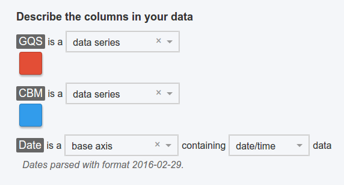

# chartwerk.datamap

The datamap contains classifications of the columns in a user's data. This branch of the API drives what controls are presented to a chart creator in the editor and much of the rest of the API. That makes the datamap the most critical part of the API to understand.

- [Data classification grammar](#data-classification) 
- [Default classifications](#default)
  - [chartwerk.datamap.base](#chartwerk-datamap-base)
  - [chartwerk.datamap.value](#chartwerk-datamap-value)
  - [chartwerk.datamap.scale](#chartwerk-datamap-scale)
  - [chartwerk.datamap.series](#chartwerk-datamap-series)
  - [chartwerk.datamap.facet](#chartwerk-datamap-facet)
  - [chartwerk.datamap.ignore](#chartwerk-datamap-ignore)
  - [Aliasing default classifications](#aliasing)
- [Custom classifications](#custom)
- [API example](#api-example)
- [Examples of the grammar](#examples)



#### Data classification grammar {#data-classification}

Because of the many types of data schema Chartwerk has to parse while creating charts it's necessary to have a scheme that defines the relationship between data schema and chart.

Most common dataviz terms don't bridge that gap. For example, describing data columns as traditional X and Y axes is tied too closely to the hard rules of a chart's coordinate plane. What happens when we want to use the same logic in terms of X & Y axes to draw both a horizontal and a vertical bar chart?

Chartwerk introduces a coarse, high-level grammar to describe tabular (i.e., spreadsheet) data schema in terms that represent a column-wise mapping to the dimensions of a chart. For example, the grammar may describe which columns in the data schema are responsible for determining the position of chart elements and which determine their color.

In practice, users classify the columns of the raw data they paste into the editor using the grammar's terms. While the terms are necessarily abstract from the perspective of template developers, in the editor, the classifications can be aliased to terms more familiar to chart creators. Once a user classifies the columns in their data, the editor renders the appropriate controls to specify other chart features, like the appropriate color scale and axes properties.

There are six data classifications built in to Chartwerk. Template developers can also add custom data classifications for individual templates.


## Default classifications {#default}

#### chartwerk.datamap.base {#chartwerk-datamap-base}

A data column classified as a **base axis** most often contains data like time series dates or categorical values. Commonly, these are values _by which_ numeric data are charted. Mortality rates _by occupation_. Stock prices _by company_.

The base axis corresponds to the traditional X axis in the case of horizontal line and bar charts. It can also represent a column of state names used to chart data in a choropleth map or a column of numeric values plotted along the X axis of a scatterplot.


#### chartwerk.datamap.value {#chartwerk-datamap-value}

A **value axis** is a single column of numeric data used to determine positional attributes of a data point. For example, the height on the Y axis of a point in a scatterplot or the number of units to draw in a unit chart.


#### chartwerk.datamap.scale {#chartwerk-datamap-scale}

**Scale axis** data is used to set the color or size of a data point. It can contain numeric or categorical data.

By design, Chartwerk does not allow for multiple scale axes, for example, scaling a data point by size and color.


#### chartwerk.datamap.series {#chartwerk-datamap-series}

Often, it is more natural to keep data in a crosstab format than in a [flat table schema](https://cran.r-project.org/web/packages/tidyr/vignettes/tidy-data.html#tidy-data) that neatly corresponds to base, value and scale axes. **Data series** accommodate that convenience.

Data series are crosstabbed columns always containing numeric values, never categorical data. These data are always translated to a positional dimension on the chart _and_ to a categorical color range.


The data series classifications are mutually exclusive with value axis and scale axis options because they contain the same data, simply represented differently in the table schema.

Take, for example, these two table schemas:

##### Crosstab

| Date     | Male | Female |
|----------|------|--------|
| 01/01/16 | 22   | 24     |
| 02/01/16 | 26   | 32     |

- `Date` -> base axis
- `Male` -> data series
- `Female` -> data series

##### Flat table schema

| Date     | Gender | Age |
|----------|--------|-----|
| 01/01/16 | Female | 24  |
| 02/01/16 | Female | 32  |
| 01/01/16 | Male   | 22  |
| 02/01/16 | Male   | 26  |

- `Date` -> base axis
- `Gender` -> scale axis
- `Age` -> value axis

In the crosstab, the `Male` and `Female` columns will represent both a color and a position, whereas in the flat table, `Gender` is a scale axis and `Age`, a value axis.

#### chartwerk.datamap.facet {#chartwerk-datamap-facet}

**Faceting columns** are always categorical data used to create sub-groups of data for small multiples, i.e., faceted charts.


#### chartwerk.datamap.ignore {#chartwerk-datamap-ignore}

Users are also given the option to specify columns to ignore in their data.


#### Aliasing default classifications {#aliasing}

While the default classification names are hard-coded into Chartwerk's API, they can be aliased in the editor's interface to terms more familiar to chart creators.

For example, a base axis in a line chart template might be aliased to "X axis." The chart creator would choose the alias from a dropdown, but the chart developer would see the column selected in the API at `chartwerk.datamap.base`.

Aliases are specified in the save template modal on the Publish tab in the editor.

## Custom data classifications {#custom}

Template creators can specify custom data classifications in the save template modal on the Publish tab in the editor.

Custom data classifications require both a class name and an alias.

Class names will be camel-cased and represented in the API at `chartwerk.datamap.custom.<className>`. They must be unique.

Custom data classifications can only specify a single data column.

### API example {#api-example}

```
{
  base: 'baseColumn',
  value: 'valueColumn',
  scale: 'scaleColumn',
  series: ['seriesColumn1', 'seriesColumn2'],
  facet: 'facetColumn',
  ignore: ['ignoreColumn1', 'ignoreColumn2'],
  custom: {
    myCustomClass1: 'customColumn1',
    myCustomClass2: 'customColumn2',
  }
}
```

## Examples of the grammar {#examples}

The following are some examples of the datamap API applied to different chart types.

#### Bar chart

A 2-column dataset of percent of executive jobs held by women by company.

- `Company` -> base axis
- `Percent women` -> value axis

#### Unit chart

A 2-column dataset of leading causes of death among 100 teens.

- `Cause of death` -> scale axis (color of each block)
- `Number of dead` -> value axis

#### Line chart

A 2-column dataset of company production rates over time.

- `Date` -> base axis
- `Production` -> value axis / data series

#### Multi-line chart

A 3-column dataset of company stock prices over time.

- `Date` -> base axis
- `Company A` -> data series
- `Company B` -> data series

#### Faceted multi-line chart

A 4-column dataset of company stock prices over time by industry.

- `Date` -> base axis
- `Company A` -> data series
- `Company B` -> data series
- `Industry` -> faceting column

#### Grouped bar chart

A 4-column dataset of recidivism rates by inmate risk category by county.

- `County` - base axis
- `Low risk` - data series
- `Medium risk` - data series
- `High risk` - data series

#### Scatterplot chart

A 4-column dataset of state SAT scores.

- `Student testing rate` -> base axis
- `SAT score` -> value axis
- `Student poverty rate` -> scale axis
- `State name` -> custom column 'tooltip'

#### Boxplots

A 3-column dataset of medical [utilization rates](https://www.cms.gov/research-statistics-data-and-systems/statistics-trends-and-reports/medicare-provider-charge-data/physician-and-other-supplier.html) by doctor by practice specialty.

- `specialty` -> base axis
- `utilization rate` -> value axis
- `doctor NPI` -> ignored column

#### Polar line chart

A 3-column dataset comparing two players performance stats.

- `Performance dimension` -> base axis
- `Player A` -> data series
- `Player B` -> data series

#### Choropleth maps

A 2-column dataset of infant mortality rates by state.

- `State` -> base axis
- `Mortality rate` -> scale axis

A 2-column dataset of states who voted for each political party.

- `State` -> base axis
- `Republican or Democrat` -> scale axis

#### Dot maps

A 3-column dataset of minority population growth rates by city.

- `Longitude` -> base axis
- `Latitude` -> value axis
- `Population growth` -> scale axis

A 3-column dataset of cities that are above or below an EPA smog threshold.

- `Longitude` -> base axis
- `Latitude` -> value axis
- `Above or below` -> scale axis
