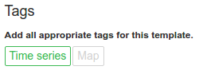

# chartwerk.template

Meta data for the template. Remember, a template is just a chart.

- [template.title](#title)
- [template.description](#description)
- [template.icon](#icon)
- [template.tags](#tags)

#### template.title {#title}

Title of the template.

#### template.description {#description}

A description of the template.

#### template.icon {#icon}

The URL path to an icon image for the template. There is currently no input for this field in the editor. We expect the backend to supply this data.

#### template.tags {#tags}

An array of tags that describe the template. These can be used to create a chart type finder in the backend application. Chartwerk queries a separate API endpoint for available tags.

