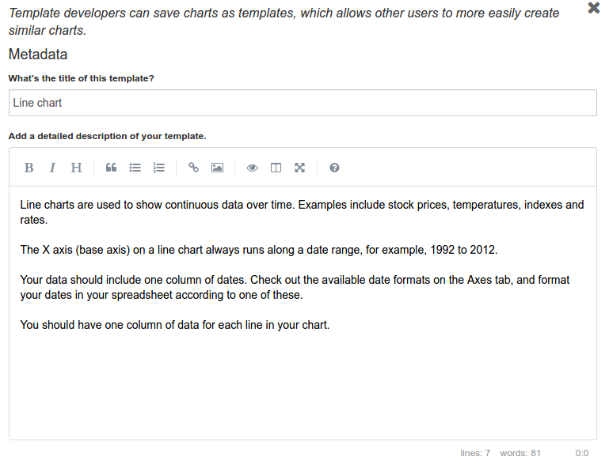

# chartwerk.template

Meta data for the template. Remember, a template is just a chart.

- [template.title](#title)
- [template.description](#description)
- [template.icon](#icon)
- [template.tags](#tags)

#### template.title {#title}

#### template.description {#description}

#### template.icon {#icon}

#### template.tags {#tags}