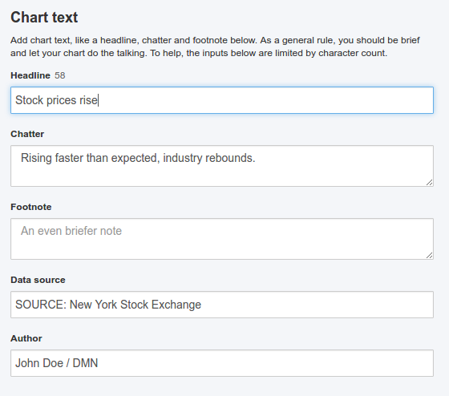

# chartwerk.text

Text elements for the chart.

All text elements expect certain chart elements to exist with an `id` property, which the text elements are rendered into. See the configurable [HTML script](scripts.md#scripts-html) for an example of the minimum required structure.



- text.headline
- text.chatter
- text.footnote
- text.source
- text.author
- [text.annotations](annotations.md)
- [text.legend](legend.md)

#### text.headline {#headline}

The headline. Text may contain markdown syntax. Rendered into a chart element with the ID `#headline`.

```HTML
<h2 id="headline"></h2>
```

#### text.chatter {#chatter}

The chatter. Text may contain markdown syntax. Rendered into a chart element with the ID `#chatter`.

```HTML
<div id="chatter"></div>
```

#### text.footnote {#footnote}

A footnote. Text may contain markdown syntax. Rendered into a chart element with the ID `#footnote`.

```HTML
<div id="footnote"></div>
```

#### text.source {#source}

The data source for the chart. Text may contain markdown syntax. Rendered into a chart element with the ID `#source`.

```HTML
<div id="source"></div>
```

#### text.author {#author}

The author of the chart. Text may contain markdown syntax. Rendered into a chart element with the ID `#author`.

```HTML
<div id="author"></div>
```

#### text.annotations {#annotations}
