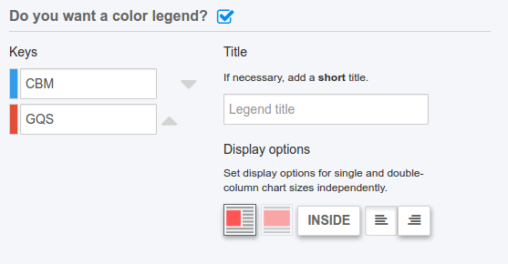

# chartwerk.text

Text elements for the chart.

All text elements expect certain chart elements to exist with an `id` property, which the text elements are rendered into. See the configurable [HTML script](scripts.md#scripts-html) for an example of the minimum required structure.

- [text.headline](#headline)
- [text.chatter](#chatter)
- [text.footnote](#footnote)
- [text.source](#source)
- [text.author](#author)
- [text.annotations](#annotations)
- [text.legend](#legend)
- [text.legend.active](#legend-active)
- [text.legend.keys](#legend-keys)
- [text.legend.title](#legend-title)
- [text.legend.{single|double}](#legend-size)
- [text.legend.{single|double}.inside](#legend-size-inside)
- [text.legend.{single|double}.align](#legend-size-align)
- [text.legend.{single|double}.background](#legend-size-background)
- [text.legend.{single|double}.width](#legend-size-width)
- [text.legend.{single|double}.position](#legend-size-position)


#### text.headline {#headline}

The headline. Text may contain markdown syntax. Rendered into a chart element with the ID `#headline`.

```HTML
<h2 id="headline"></h2>
```

#### text.chatter {#chatter}

The chatter. Text may contain markdown syntax. Rendered into a chart element with the ID `#chatter`.

```HTML
<div id="chatter"></div>
```

#### text.footnote {#footnote}

A footnote. Text may contain markdown syntax. Rendered into a chart element with the ID `#footnote`.

```HTML
<div id="footnote"></div>
```

#### text.source {#source}

The data source for the chart. Text may contain markdown syntax. Rendered into a chart element with the ID `#source`.

```HTML
<div id="source"></div>
```

#### text.author {#author}

The author of the chart. Text may contain markdown syntax. Rendered into a chart element with the ID `#author`.

```HTML
<div id="author"></div>
```

#### text.annotations {#annotations}

Free text annotations are represented as an array of objects. They are rendered as absolutely positioned HTML elements.


```js
[
  {
    size: 's',
    w: 100,
    x: 10,
    y: 15,
    align: 'l',
    fontSize: 'm',
    background: false,
    text: 'This is a **text** note.',
    color: '#2d3035'
  }
]
```

##### text.legend {#legend}


The legend contains properties to draw chart keys. Legends are HTML elements, either flowed above the chart or absolutely positioned within the chart space.



#### text.legend.active {#legend-active}

Boolean weather the user has opted to create a color legend for the chart.

#### text.legend.keys {#legend-keys}

Keys are an array of objects:

```js
[
  {
    color: "#FF0000",
    text: "Republican"
  },
  {
    color: "#0000FF",
    text: "Democrat"
  }
]
```

`color` is derived from the range array of the color axis.

`text` is input by the user. When using a quantized color scale, the text is pre-filled with the minimum value of each color bin _but_ is overwritable by the user.

#### text.legend.title {#legend-title}

A title for the legend.

#### text.legend.{single|double} {#legend-size}

Independent legend options for single or double-column size charts.

#### text.legend.{single|double}.inside {#legend-size-inside}

Boolean whether to display the legend within the chart space. If false, assumed to display flowed above.

Flow of individual keys is presumed to be left-to-right when rendering the legend above the chart and top-to-bottom, i.e., stacked, when rendered within the chart space.

#### text.legend.{single|double}.align {#legend-size-align}

Either `l` or `r` for left or right aligning the chart container above the chart. Option only displayed when `legend.{single|double}.inside` is `false`.

#### text.legend.{single|double}.background {#legend-size-background}

Boolean whether to draw a background behind the legend. Option only displayed when `legend.{single|double}.inside` is `true`.

#### text.legend.{single|double}.width {#legend-size-width}

Width in pixels of the legend container.

#### text.legend.{single|double}.position {#legend-size-position}

An object containing `x` and `y` position of the legend container within the chart space. Option only displayed when `legend.{single|double}.inside` is `true`.

```js
{
  x: 10,
  y: 15
}
```