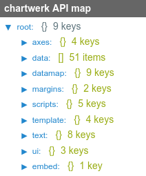

# Chartwerk API

The Chartwerk API creates a complete JSON representation of every chart  Chartwerk makes, from the raw data a user pastes into the editor to the individual options she chooses for things like colors and text labels to the template code that parses those options to create the chart.

The entire UI state in the editor is also represented in the API's JSON, making charts extremely portable.

Chart creators will likely never see the API, but template developers will interact with it directly, as it contains all the key information necessary to build a chart.

#### Learning the API

Complete documentation to the API is included here, but I'd recommend the best way to understand how the API works is to actually observe it in the editor.

Open the full screen JavaScript editor on the Code tab and check out the API treeview chart. There you can see the API populated with real data parsed by the template.

