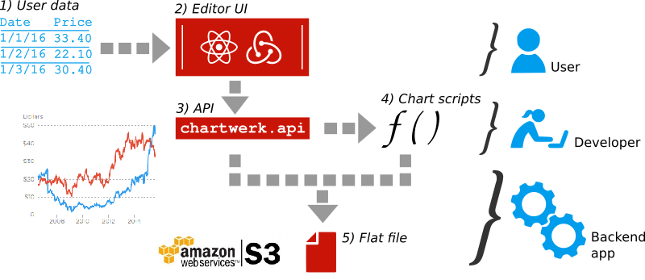

# How chartwerk makes charts

Each chart in Chartwerk starts with a set of data and ends with a chart drawn from a template that has consumed that data. Strictly speaking, the process flow from data to chart in Chartwerk is like most other chart builders, except that the process happens more out in the open in Chartwerk's Editor. 

### How data becomes a chart

The following diagram represents the basic flow of how Chartwerk turns tabular data into a chart.

  

  

#### Steps

1. A user supplies tabular data to the Chartwerk Editor. This step presumes the user has already determined which chart type she wants to make and the Editor is preloaded with that chart template.
2. User makes selections in the Editor that determine how different features of this chart should be formatted, for example, axes and labels.
3. Chartwerk takes those user selections and any defaults which are part of the chart template and turns them into an API, which is defined as a global object, `chartwerk`.
4. The chart template has scripts which are written to consume the API and draw the chart using whatever dependencies needed. These scripts are called in the Editor -- namely, the `draw()` function -- and create a live preview of the chart for the user.
5. After a user saves their chart, the Chartwerk backend app takes the API and the chart scripts and saves them to a flat HTML file (two files, actually: one for for each size of chart, double and single-wide). The flat file will call the chart's drawing function, just as in the Editor, and draw the chart on the page. The file is saved on Amazon S3 or another hosting service or server.

### Ownership

Ownership of the steps is broken down in the diagram. Basically, a user supplies the data and uses the Editor's UI to specify chart formatting. She doesn't interact with the API or with the chart scripts in any way. The developer writes the chart scripts to consume the API. The backend application does the rest.

### From a developer's perspective

The previous process diagram may seem a little backwards from the perspective of a chart template developer. She builds templates long before a user builds any charts with them and will not be an _active_ part of the process once the template is complete, though she can jump back in on any individual chart to tweak her code or update the template.

